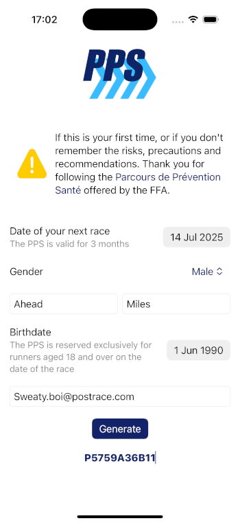

# 🏃 PPS

Quickly generates a PPS code without having to view the videos.

Save you 3 minutes with this app, to take the risk of dying for good! 👍

The reason for this app is not to save my time, but to test if it was feasible. Losing a few days of development to save 3 minutes of time every 3 months or so ... it's ridiculous. Especially when you understand the educational purpose of this site (not great, but better than nothing).

## ⚠️ Important

If this is your first time, or if you don't remember the risks, precautions and recommendations. Thank you for following the [Parcours de Prévention Santé](https://pps.athle.fr) offered by the FFA.

Take care of yourself and those around you.

## 🚀 Postman collection

There is a [postman collection](PPS.postman_collection.json) with all the request at the root of this project.

## ✅ TODO

🔲 Unit tests  
🔲 Localization  
🔲 Feedback on the form
